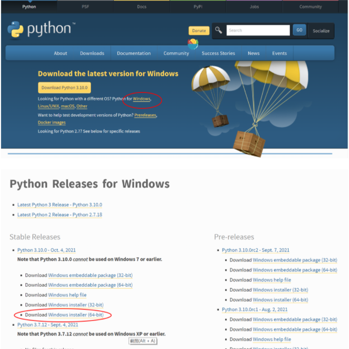
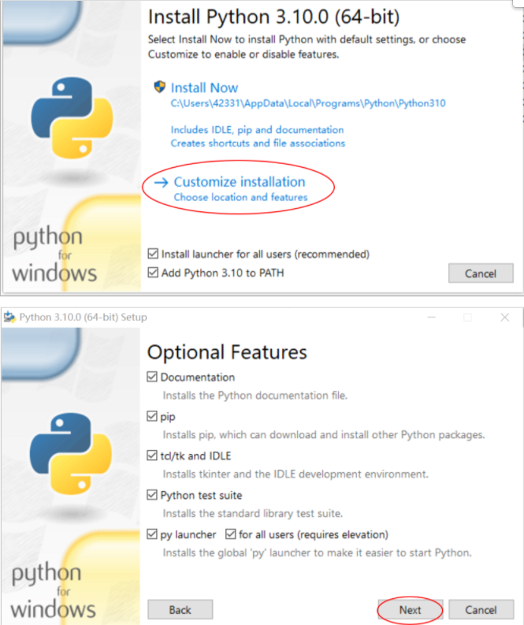
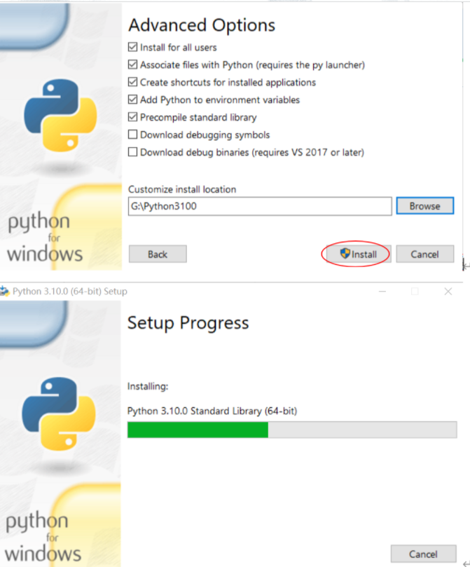
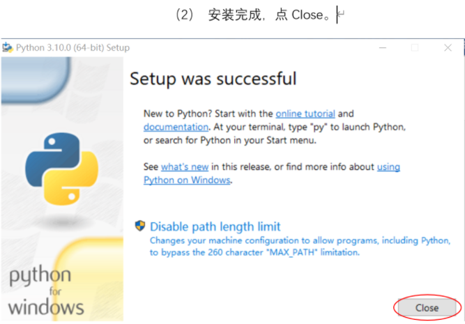
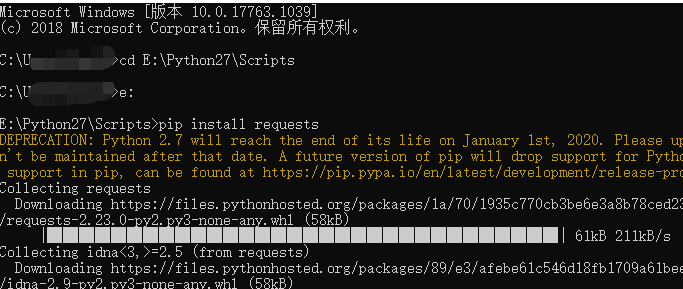
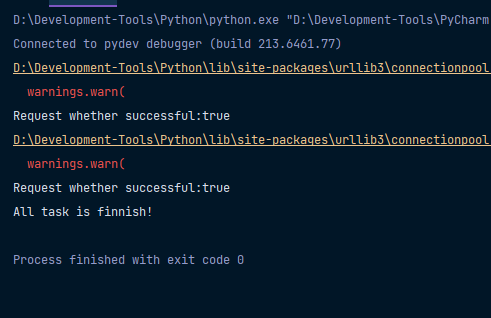

# How to use
1.首先确保本地有 python 的开发环境 （已有的可以跳过步骤1）

- 可以在 https://www.python.org/downloads/选择适合的版本
 
- 安装 Python 解释器
  - 双击 python-3.10.0-amd64 文件打开运行，将界面中下方的两项都勾选，单击 Customize installation，进入optional Feature页面，单击Next。
   
  - 在高级选项界面，选择Python的安装路径，并按下图所示勾选需要的选项，单击Install,进行安装。
   
  - 

2. 打开 cmd 命令行，切换到 Python 安装目录下的 Scripts，再输入 pip install requests。回车

3.找到项目目录下的 info.txt,按照示例的格式，按顺序输入dic账号id、邮箱、钱包地址、推特名。顺序一定不能错！

4.打开 cmd 命令行 python main.py 回车,喝一杯咖啡等待程序跑完如下图所示即可：

